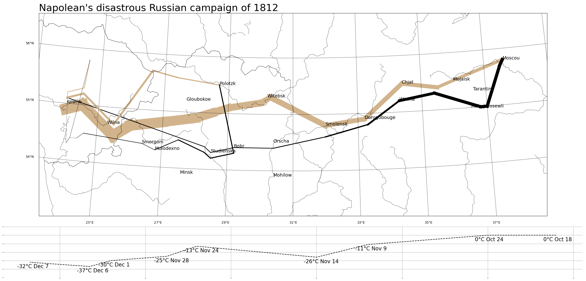

# 練習專案二：拿破崙征俄戰爭

## 簡介

這個專案「拿破崙征俄戰爭」復刻了名聞遐邇的 [Charles Minard's Napoleon's disastrous Russian campaign of 1812](https://en.wikipedia.org/wiki/Charles_Joseph_Minard#/media/File:Minard.png) 資料視覺化，我們使用了 `pandas` 與 `sqlite3` 建立了資料庫，利用 `matplotlib` 與 `basemap` 進行概念驗證並做出成品。

## 如何重現

- 安裝 [Miniconda](https://docs.anaconda.com/miniconda)
- 依據 `environment.yml` 建立環境：

```bash
conda env create -f environment.yml
```

- 將 `data/` 資料夾中的 `minard.txt` 置放於工作目錄中的 `data/` 資料夾。
- 啟動環境並執行 `python create_minard_db.py` 就能在 `data/` 資料夾中建立 `minard.db`
- 啟動環境並執行 `python plot_with_basemap.py` 就能生成 `minard_clone.png`

